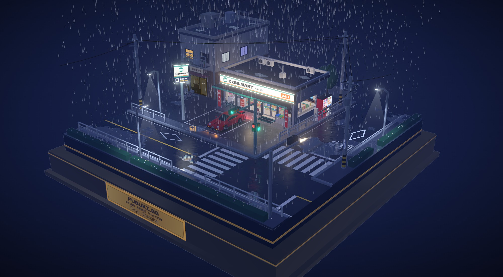

# FUBUKI_BB · 雨夜便利店个人主页

[0xbb.me](https://0xbb.me) 的源码。首页是一个放在展示台上的微缩模型：下着雨的夜里，日式便利店街角亮着灯，门口停着一辆打双闪的红色保时捷。点一下展示台上的铭牌，镜头就会分三段移动，每停一处讲一段个人资料。



## 怎么浏览

整体视角（打开页面时看到的全景）：

| 操作 | 效果 |
| --- | --- |
| 拖动 | 旋转模型 |
| 滚轮或双指捏合 | 缩放 |
| 右键拖动或双指拖动 | 平移 |
| 点击铭牌 | 进入资料视角 |
| 按 Tab 选中「查看资料」后回车 | 进入资料视角（键盘用户） |

资料视角（点铭牌之后）：

| 操作 | 效果 |
| --- | --- |
| 滚轮、上下滑动、PageDown / PageUp、方向键、空格 | 一次翻一段，翻页动画约 1 秒；动画结束 0.5 秒后才能翻下一段 |
| Esc 或左上角「返回全景」 | 回到整体视角（三维场景加载好之后才可用） |
| 右上角 EN / 中 | 切换语言 |

三段资料依次是：头像、名字、职位和所在地；一段自我介绍；关注方向和 GitHub、LinkedIn、掘金、邮箱四个链接。

## 画面里有什么

- 雨只下在展示台上方，落地会溅起小水花，屋檐边缘在滴水
- 湿路面上有灯光倒影，水洼里有雨点荡开的波纹
- 便利店招牌偶尔闪一下，自动门隔一会儿开关一次
- 保时捷熄火停着，只有四角的双闪在亮
- 路口信号灯 20 秒切换一轮，行人灯变红前会闪
- 铭牌边框有呼吸一样的微光，提示可以点

电脑上默认开启全部画面效果。手机上或帧率不够时，会自动关掉地面倒影等较重的效果，保证画面流畅。

## 没有 3D 也能看

- 加载页上有「先看资料」按钮，点了就直接看资料，三维场景在后台继续加载，加载好后自动出现。
- 浏览器不支持 WebGL（网页里画 3D 用的接口），或者三维场景加载失败时，页面会自动切到资料视角，并提示「3D 场景无法加载」。
- 页面里还带了一份不依赖脚本的英文资料，供搜索引擎读取。

## 技术栈

- Vite 6 + React 19 + TypeScript
- Three.js：卡通描边渲染、泛光、镜面湿地面；模型全部用代码里的几何体拼出来，不加载外部模型文件
- 字体随站点一起打包，不从外部网站加载
- 测试用 Bun 自带的测试工具；浏览器相关测试驱动本机 Chrome 的无窗口实例

## 目录结构

| 位置 | 内容 |
| --- | --- |
| `App.tsx`、`index.tsx` | 页面入口，管理「整体视角 / 进入中 / 资料视角 / 退出中」这几种状态 |
| `components/` | 加载页、三维画面容器、资料段、翻页控制、键盘用的「查看资料」按钮 |
| `diorama/` | 三维场景：便利店、街道、保时捷、铭牌、天气、湿地面、镜头停靠点、画质档位 |
| `data.ts`、`copy.ts`、`language.ts` | 个人资料、中英文文案、语言判断 |
| `plugins/htmlPlugin.ts`、`metadata.json` | 构建时写入网页标题、搜索描述和分享卡片信息 |
| `public/` | 头像、robots.txt、sitemap、第三方许可声明 |
| `tests/` | 单元测试与浏览器端到端测试 |
| `.bb-spec/docs/` | 需求规格（spec）与实施计划（plan） |

## 本地开发

需要先装好 [Bun](https://bun.sh)。跑浏览器相关的测试还需要本机装有 Chrome。

```bash
bun install --frozen-lockfile
bun run dev       # 开发服务器，改代码后页面自动刷新
bun run build     # 生成 dist/ 静态文件
bun run preview   # 本地预览 dist/ 里的构建结果
bun test          # 跑全部测试，约 5 分钟
```

- 端到端测试和发布检查读的是 `dist/` 里的构建结果，跑测试前先执行一次 `bun run build`。
- Chrome 不在默认位置时，用环境变量 `PORTFOLIO_CHROME_PATH` 指定 Chrome 可执行文件的路径。

## 部署

推送到 `main` 分支后，GitHub Actions（`.github/workflows/deploy.yml`）会安装依赖、执行 `bun run build`，再把 `dist/` 发布到 GitHub Pages。

## 许可

代码使用 MIT 许可，全文见 `LICENSE`。React、Three.js 和站内字体的版权与许可声明在 `public/THIRD_PARTY_NOTICES.txt`，会随构建一起发布。
